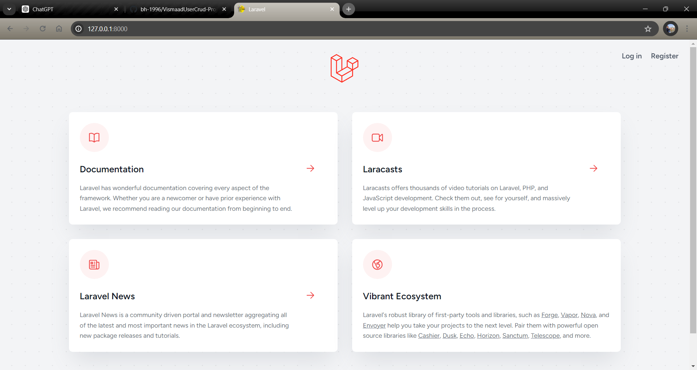
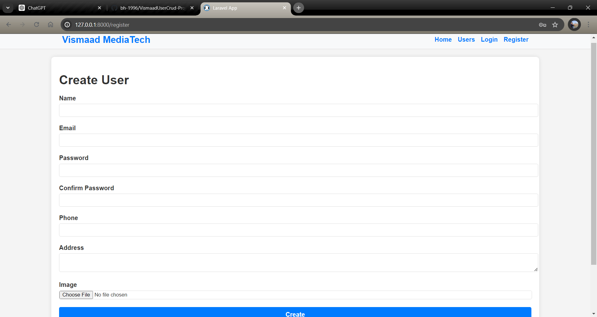
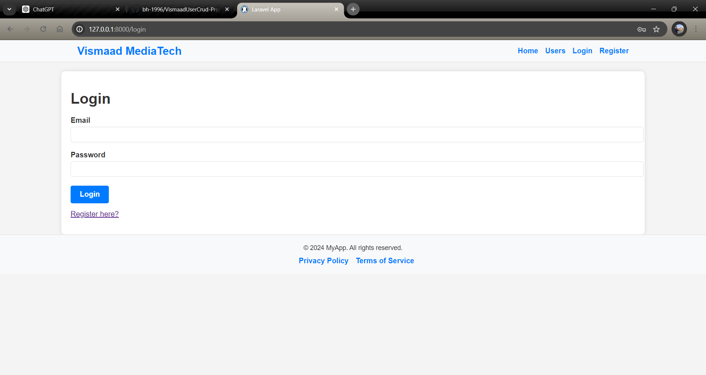
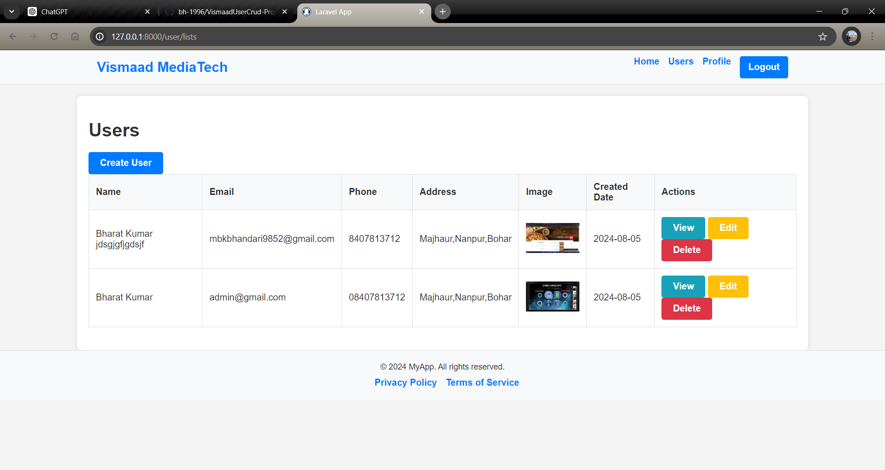
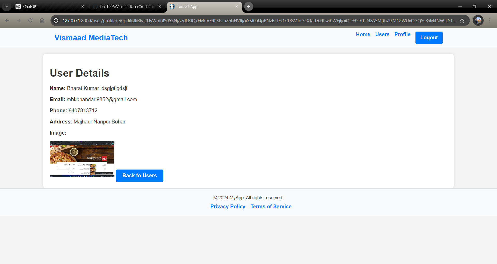
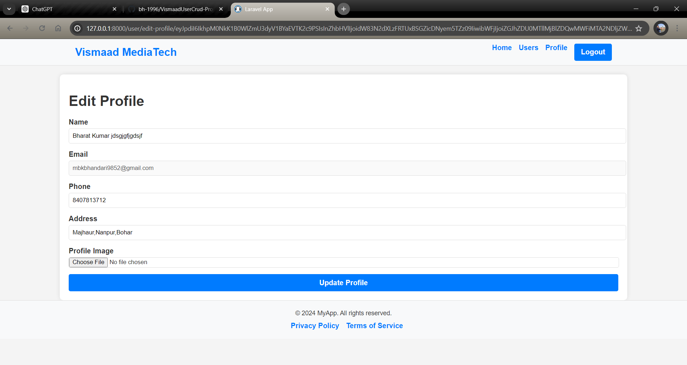
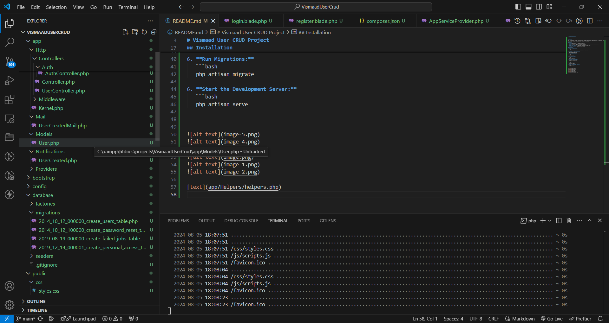

# VismaadUserCrud-Project

# Vismaad User CRUD Project

## Overview

This Laravel project includes user login, signup, and CRUD operations for a generated table. It demonstrates the use of common helper functions and the model boot function on user signup.

## Features

- **Login:** Users can log in with their credentials.
- **Signup:** Users can register with necessary details.
- **CRUD Operations:** Create, Read, Update, and Delete operations on a randomly generated table.
- **Common Helper Function:** Used in both controllers and Blade files.
- **Model Boot Function:** Implemented on user signup.

## Installation

1. **Clone the Repository:**
   ```bash
   git clone git@github.com:bh-1996/VismaadUserCrud-Project.git

2. **Navigate to Project Directory:**
   ```bash
   cd VismaadUserCrud-Project

3. **Install Dependencies:**
   ```bash
    composer install

4. **Set Up Environment:**
    -Copy the .env.example file to .env and update the database and application settings:
   ```bash
   cp .env.example .env

5. **Generate Application Key:**
   ```bash
   php artisan key:generate

6. **Run Migrations:**
   ```bash
   php artisan migrate

6. **Start the Development Server:**
   ```bash
   php artisan serve


Also add in env 
**Env**
MAIL_MAILER=smtp
MAIL_HOST=sandbox.smtp.mailtrap.io
MAIL_PORT=2525
MAIL_USERNAME=******
MAIL_PASSWORD=******
MAIL_ENCRYPTION=null
MAIL_FROM_ADDRESS="hello@example.com"
MAIL_FROM_NAME="${APP_NAME}"


**Database**
DB_CONNECTION=mysql
DB_HOST=127.0.0.1
DB_PORT=3306
DB_DATABASE=vismaad_crud
DB_USERNAME=root
DB_PASSWORD=








[text](app/Helpers/helpers.php)
